# Automate Stack Validation

Test case database for validating Automate stack implementations across **Software**, **Mechanical**, **Holoscan FPGA**, and **Multi Axis Motor Control FPGA** subcomponents.

The schema mirrors the column headers in `Automate5_Test_Cases.xlsx` (sheet `Automate5_Test_Cases`), snake-cased. The repo provides a **PyQt6 desktop GUI** for browsing, filtering, and adding test cases, plus a **CLI** and **batch launcher** for validating files and exporting Confluence-ready Markdown / CSV reports.

## Demo



---

## Repository Structure

```
automate_validation/
├── README.md
├── requirements.txt
├── run.bat                          # One-click launcher (Windows)
├── demo/
│   ├── demo.svg                     # Animated workflow demo
│   └── generate_demo.py             # Script to regenerate the SVG
├── schema/
│   └── test_case_schema.json        # JSON Schema defining test case fields
├── templates/
│   └── test_case_template.yaml      # Blank template for new test cases
├── scripts/
│   ├── manage_tests.py              # CLI tool: validate, report, summary
│   └── gui.py                       # PyQt6 desktop GUI
└── automate_5/                      # ← Current implementation round
    ├── timeline.yaml                 # Work-week schedule grid (Excel `Timeline` tab)
    ├── software/
    │   └── test_cases.yaml
    ├── mechanical/
    │   └── test_cases.yaml
    ├── holoscan_fpga/
    │   └── test_cases.yaml
    ├── multi_axis_motor_control_fpga/
    │   └── test_cases.yaml
    └── gui/
        └── test_cases.yaml          # PySide6/QML GUI test cases (TC-GUI-*)
```

When the next Automate version begins (e.g. Automate 6), create a new top-level folder `automate_6/` with the same four subcomponent subdirectories.

---

## Test Case Fields

Field names mirror the column headers in `Automate5_Test_Cases.xlsx` (sheet `Automate5_Test_Cases`), snake-cased. Every test case entry contains these fields:

| Field | Excel column | Type | Description |
|---|---|---|---|
| `test_case_id` | Test Case ID | string | Unique ID, e.g. `TC-FPGA-001` (see prefixes below) |
| `owner` | Owner | string / null | Person or pair responsible for the test |
| `component` | Component | string / null | Functional area being validated (e.g. `MIPI Camera Input`) |
| `dependency` | Dependency | list / null | List of test IDs that must pass first |
| `precondition` | PreCondition | string / null | Required setup or hardware state before running |
| `test_name` | Test Name | string | Short descriptive name |
| `description` | Description | string / null | Plain-language explanation for a non-expert user |
| `steps` | Steps | list / null | Ordered list of action strings |
| `expected_result` | Expected Result | string / null | What constitutes a **pass** |
| `fail_conditions` | Fail Conditions | string / null | What constitutes a **fail** |
| `priority` | Priority | string / null | `P0`, `P1`, `P2`, … |
| `severity` | Severity | string / null | `Critical`, `Major`, `Minor`, … |
| `automation_readiness` | Automation Readiness | string / null | `Automatable`, `Semi-Automatable`, `Manual` |
| `automation_status` | Automation Status | string / null | `Ready`, `Not Ready`, `In Progress`, … |
| `test_environment_ci_hil` | Test Environment (CI/HIL) | string / null | `CI`, `HIL` |
| `observations` | Observations | string / null | Free-form notes / context |
| `jira_link` | Jira Link | string / null | Link to associated Jira ticket |
| `next_action_if_fail` | Next Action (if Fail) | string / null | Triage / debug step if the test fails |

Empty Excel cells become `null` in YAML. `Steps` and `Dependency` values are split on `;`, `,`, and newlines into YAML lists.

---

## Test ID Convention

Test Case IDs use the prefixes defined in the Excel `Legend` tab. Each prefix maps to one of the four subcomponent folders under `automate_5/`.

| Prefix | Meaning | Folder | Example |
|---|---|---|---|
| `TC-FPGA` | Test on Holoscan FPGA (MIPI, Ethernet, RISC-V firmware, …) | `holoscan_fpga/` | `TC-FPGA-001` |
| `TC-VLA` | Vision-Language-Action / Holoscan vision pipelines | `holoscan_fpga/` | `TC-VLA-001` |
| `TC-SW` | Software stack (UDP, CAN-FD, EtherCAT, …) | `software/` | `TC-SW-001` |
| `TC-SYS` | End-to-end system / cross-stack integration | `software/` | `TC-SYS-001` |
| `TC-HW` | Hardware / mechanical / robot arm | `mechanical/` | `TC-HW-01` |
| `TC-GUI` | PySide6 / QML desktop GUI (Automate5 Industrial Control Hub) | `gui/` | `TC-GUI-001` |

Multi Axis Motor Control FPGA (`multi_axis_motor_control_fpga/`) is reserved for future MAMC-prefixed test cases; the file is currently empty.

---

## Getting Started

### Prerequisites

```bash
pip install -r requirements.txt
```

### Quick Start (Windows)

Double-click **`run.bat`** or run it from a terminal:

```batch
run.bat              :: Launch the GUI (default)
run.bat gui          :: Launch the GUI
run.bat validate     :: Validate all Automate 5 test cases
run.bat report       :: Print Markdown report to console
run.bat report csv   :: Export CSV to automate_5_results.csv
run.bat summary      :: Print priority / automation-status counts
```

The batch script auto-creates a `.venv` and installs dependencies on first run.

### Launch the GUI (recommended)

```bash
python scripts/gui.py
```

The GUI provides:

- **Sortable test case table** — every column from `Automate5_Test_Cases.xlsx` in its original order (Test Case ID, Owner, Component, Dependency, PreCondition, Test Name, Steps, Expected Result, Fail Conditions, Priority, Severity, Automation Readiness, Automation Status, Test Environment, Observations, Jira Link, Next Action). Long cells are elided with full-text tooltips on hover; priority and automation-status cells are colour-coded.
- **Timeline view** — the **📅 Timeline** button (next to *View Details*) opens a separate window that mirrors the Excel `Timeline` tab: an editable grid of test cases × work-weeks (WW17 – WW29) plus three metric rows (`% PASS`, `% FAIL`, `% NOT RUN`). Every test case in the YAML database is included automatically, even if it didn't have a row in the original Excel sheet. Edits are persisted to `automate_5/timeline.yaml`.
- **Filters** — narrow by subcomponent, priority, automation status, or environment.
- **Detail view** — double-click any test to see all fields including steps, dependencies, precondition, expected result, fail conditions, and notes.
- **Add test case** — guided form that auto-generates the next sequential `test_case_id` based on the chosen subcomponent + ID prefix, with editable dropdowns for priority, severity, automation readiness/status, and environment.
- **Version selector** — switch between Automate versions from the dropdown.
- **Summary bar** — live counts by priority (P0/P1/…) and automation status (Ready / Not Ready).

> **Note:** If `python` doesn't find PyQt6, use the venv directly:
> ```bash
> .venv\Scripts\activate     # Windows
> python scripts/gui.py
> ```

### CLI Usage

#### Validate test case files

Checks all YAML files for required fields (`test_case_id`, `test_name`), the `TC-<PREFIX>-<NN[N]>` ID format, allowed prefixes per subcomponent, duplicate IDs across files, and unknown / wrongly-typed fields:

```bash
python scripts/manage_tests.py validate automate_5
```

#### Generate a report

**Markdown** (paste directly into Confluence):

```bash
python scripts/manage_tests.py report automate_5
```

**CSV** (import into Confluence or spreadsheet):

```bash
python scripts/manage_tests.py report automate_5 --format csv -o report.csv
```

The report mirrors the full 17-column layout of `Automate5_Test_Cases.xlsx` in its original column order, so the output is interchangeable with the source spreadsheet. Empty cells render as `-`.

#### Summary counts

Quick view of priority and automation-status breakdowns:

```bash
python scripts/manage_tests.py summary automate_5
```

> **Note on execution tracking:** the legacy "Record Result" workflow (mark a test pass/fail with date / executed-by / notes) has been removed because `Automate5_Test_Cases.xlsx` does not have those columns. Use `automation_status` for state (`Ready` / `Not Ready` / `In Progress` / `Blocked`) and `observations` for free-form notes; or, if you want execution-result tracking back, ask to add `executed` / `result` / `execution_date` / `executed_by` as additional non-Excel YAML fields.

---

## How to Add a New Test Case

### Via the GUI

1. Launch the GUI (`python scripts/gui.py`).
2. Click **"＋ Add Test Case"**.
3. Pick the **Subcomponent** — the **ID prefix** dropdown auto-narrows to the prefixes allowed for that folder (e.g. picking *Software* offers `TC-SW` and `TC-SYS`).
4. The next sequential **Test Case ID** is shown automatically; you cannot type it manually.
5. Fill in **Test Name** (required) and any optional metadata, dependencies, steps, criteria, and notes. The dropdowns for priority / severity / automation readiness / automation status / environment are editable, so you can pick a suggested value or type a new one.
6. Click **Save** — the YAML file is updated in place.

### Via YAML (manual)

1. Open the `test_cases.yaml` file for the relevant subcomponent under the current Automate version:
   ```
   automate_5/<subcomponent>/test_cases.yaml
   ```
   Choose the folder using the [Test ID Convention](#test-id-convention) table above.

2. Use an existing entry in the same file as a starting point.

3. Fill in the fields (see [Test Case Fields](#test-case-fields)). Required fields in practice are `test_case_id` and `test_name`; everything else can be `null` or omitted while the test is still being scoped.

4. For multi-item fields:
   - **`dependency`** — list of test IDs (e.g. `[TC-FPGA-001, TC-FPGA-002]`). Use `null` (or omit) if there are no dependencies.
   - **`steps`** — list of short action strings, in execution order.

5. After editing, mirror the change back into `Automate5_Test_Cases.xlsx` (the Excel sheet remains the human-facing view used in reviews and reports).

### Example: Adding a new software test

Append this to `automate_5/software/test_cases.yaml` under the `test_cases:` list:

```yaml
  - test_case_id: TC-SW-004
    owner: Jane Doe
    component: Configuration Service
    dependency:
      - TC-SW-001
    precondition: Service running with default config
    test_name: Config Hot Reload
    description: Checks that the service notices a config file change and applies it without restarting.
    steps:
      - Start the target service with default config
      - Modify a configuration value in the config file
      - Verify the service applies the new configuration without restart
    expected_result: Config change detected and applied within 5 seconds without service restart
    fail_conditions: Service does not detect change, requires restart, or applies incorrect value
    priority: P1
    severity: Major
    automation_readiness: Automatable
    automation_status: Not Ready
    test_environment_ci_hil: CI
    observations: null
    jira_link: null
    next_action_if_fail: Inspect file watcher and config parser
```

---

## Adding a New Automate Version

1. Create a new top-level directory (e.g. `automate_6/`).
2. Create subdirectories for each subcomponent:
   ```
   automate_6/
   ├── software/
   │   └── test_cases.yaml
   ├── mechanical/
   │   └── test_cases.yaml
   ├── holoscan_fpga/
   │   └── test_cases.yaml
   └── multi_axis_motor_control_fpga/
       └── test_cases.yaml
   ```
3. Each `test_cases.yaml` should start with:
   ```yaml
   test_cases: []
   ```
   Or copy and adapt test cases from the previous version.
4. All CLI commands accept the version directory name as the first argument:
   ```bash
   python scripts/manage_tests.py validate automate_6
   python scripts/manage_tests.py report automate_6
   ```

---

## Confluence Integration

The `report` command outputs Markdown tables that can be pasted into Confluence using the **Markdown macro** or the insert-markup feature. For bulk import, use the CSV format and Confluence's CSV macro or import tools.

### Workflow

1. Keep `automate_5/*/test_cases.yaml` in sync with `Automate5_Test_Cases.xlsx`.
2. Generate the report: `python scripts/manage_tests.py report automate_5 --format csv -o automate_5_results.csv`
3. Upload or paste the result into the target Confluence page.

---

## Contributing

> **Rule: Always update this README** when introducing any structural or functional change to the repository (new scripts, new fields, new subcomponents, workflow changes, etc.). Keep it as the single source of truth for navigating and using this project.
